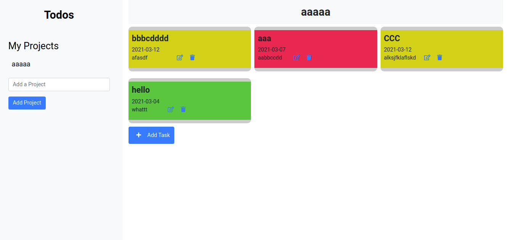

# Todo List App

> Todo List App is a web Application to manage your list of tasks. This project follows concept of OOP, ES6, and Functional Programming.

### You can access a Live Demo [HERE](https://admiring-lichterman-9495e0.netlify.app/)

## Features Built

- User can create Projects
- User can create Task inside a project (user need to select project to create a new tasks)
- Use can edit and delete tasks.

## Built With

- HTML5
- CSS3
- Javascript
- Bootstrap

## Getting Started

To get a local copy up and running follow these simple steps.

- [ ] Open your terminal
- [ ]  Navigate to the directory where you will like to install the repo by running `cd FOLDER-NAME` 
- [ ] Clone this repository
 > `git clone https://github.com/Div685/Todo-List-JS.git`
- [ ] To install Webpack and dependencies run the command

**How to Use Tests for todo-list**
- [ ] clone this repo `https://github.com/Div685/Todo-List-JS.git`
- [ ] navigate to the project directory.
- [ ] run `npm install` and then `npm run test`.

 
## Authors

👤 **Gzim Asani**
- Github: [@GzimAsani](https://github.com/GzimAsani)
- Linkedin: [GzimAsani](https://www.linkedin.com/in/gzim-asani-83390a17a/)

👤 **Divyesh Patel**

- GitHub: [@Div685](https://github.com/Div685)
- Twitter: [@div_685](https://twitter.com/div_685)
- LinkedIn: [Divyesh Patel](https://www.linkedin.com/in/divyesh-daxa-patel/)

## 🤝 Contributing

Contributions, issues and feature requests are welcome!

Feel free to check the [issues page](https://github.com/Div685/Todo-List-JS/issues).

## Show your support

Give a ⭐️ if you like this project!